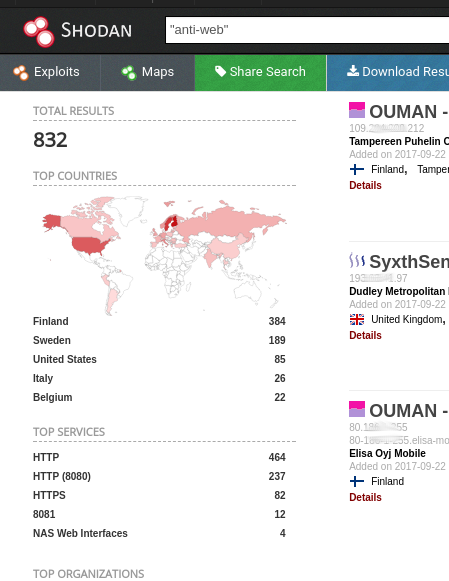
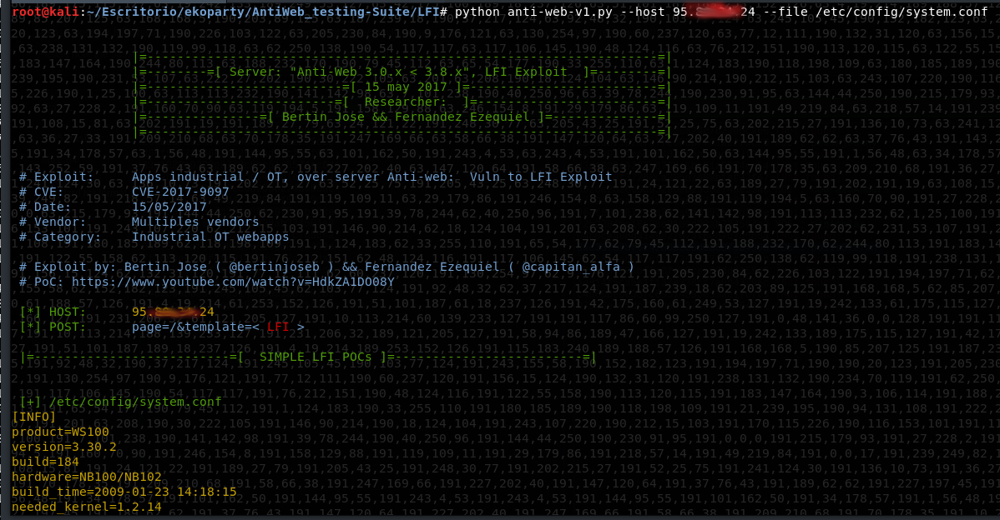
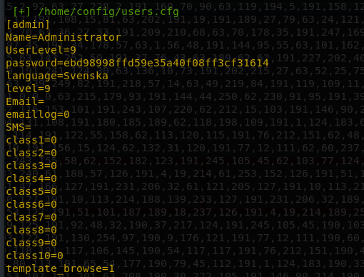
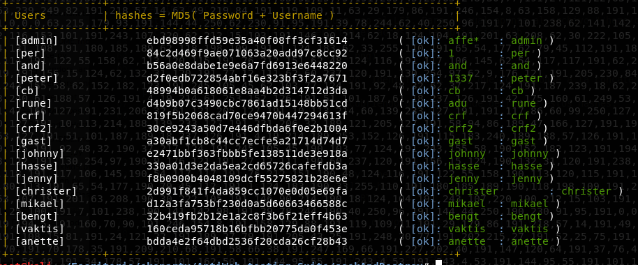
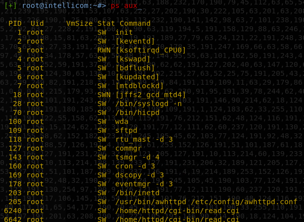
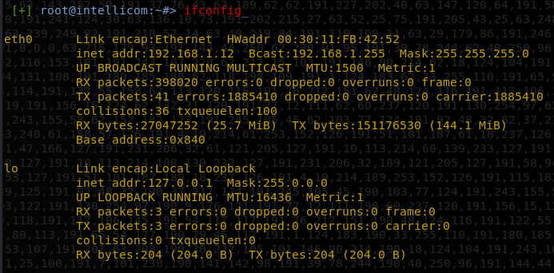

# ICS/OT AntiWeb: Testing Suite

## Introducción 
Una vulnerabilidad ha sido encontrada en aplicaciones web asociadas a ICS/OT que corren sobre servidores [Anti-Web](https://github.com/hoytech/antiweb/) (hasta su version 3.8.7).
La vulnerabilidades que se han identificado  afectan a varios fabricantes de renombre en la industria de la automatización de procesos industriales y telecomunicaciones. Estos devices ya cuentan con dos similares y viejos CVEs (CVE-2010-4730 & CVE-2010-4733) a lo que luego de reportar consiguió un tercero CVE (2017-9097) e inmediatamente el vendor lanzó un parche. En inmediatamente siguieron otros. 

Para tener una referencia aproximada del grado de exposición con la que cuentan esto dispositivos nos valemos de los host que se encuentran indexados en Shodan, siendo estos un poco mayor de 800 devices potencialmente vulnerables. 

Con respecto al LFI que nuestra tool procura de explotar, hoy los distintos vendors afectados ya cuentan con sus respectivos parche oficiales que contrarresta la vulnerabilidad. Por lo que de alguna forma el intentar explotar el fallos viene a corroborar el compromiso de los operadores y responsables de estas tecnologías, respondiendo a una pregunta fundamental: "Se habrán instalado los parches correspondientes?" 

# Tres tools:
Una de las primeras herramientas procura explotar y corroborar la existencia de un LFI. Una segunda herramienta tratara de sacarle partido al LFI, tomando el archivo en donde se guardar las credenciales que dan acceso al panel web. El donde los usernames están en plano y las passwords están hasheadas con md5 que la herramienta tratara de romper.
y finalmente una última herramienta que explotara un RCE. 

# Quick start

	usr@pwn:~$ git clone https://github.com/ezelf/AntiWeb_testing-Suite

***
	usr@pwn:~$ cd AntiWeb_testing-Suite
	usr@pwn:~$ ls -l 
	total 16
	drwxr-xr-x 4 root root 4096 sep 14 21:05 LFI
	drwxr-xr-x 4 root root 4096 sep 14 21:05 RCE
	-rwxrwxr-x 1 root root 1852 sep 24 08:42 README.md
	drwxr-xr-x 3 root root 4096 sep 24 08:00 seekAndDestroy
***

# Tool [1]: "Anti-web" 
### Introducción
Simplemente corrobora la existencia del LFI, consultando unos paths predefinidos y / o dandole la posibilidad al usuario de pasar su propio path.

Opcionalmente uno podra pasarle una cookie de session (valida).

### Uso:

 	usr@pwn:~$ python anti-web-v1.py --help
	usage: anti-web.py [-h] [-v] --host HOST [--port PORT] [--file LFI]

	[+] CVE: CVE-2017-9097

	optional arguments:
	  -h, --help     show this help message and exit
	  -v, --version  show program's version number and exit
	  --host HOST    host
	  --port PORT    Set port (default = 80)
	  --file LFI     Test LFI
	  -ck COOKIE     Set Cookie

	[+] Demo: anti-web.py --host 192.168.1.100 --port 80

# Tool [2]: "Seek And Destroy"
### Introducción.
Esta Herramienta procura dale un buen uso al LFI. Para lo cual apunta al archivo "/home/config/users.cfg" en donde se encuentras las credencias que permiten el acceso a la aplicacion web. 

"Seek And Destroy", Parsea este archivo, Identifica el hash que corresponde a la concatenacion del password y su usuario pasado a la funcion de hash Md5.
Con listas precalculadas, se iran descubriendo que se esconde detras de estos hashes. 

Se podra atacar individualmente un solo host o una lista de estos

### Uso:

	usr@pwn:~$ python seekAndDestroy.py --help
	usage: seekAndDestroy.py [-h] [-v] [--host HOST] [--list HOST_LIST]
	                         [--port PORT]

	[+] Obtain and break the credentials of your industrial control system .

	optional arguments:
	  -h, --help        show this help message and exit
	  -v, --version     show program's version number and exit
	  --host HOST       host
	  --list HOST_LIST  hosts
	  --port PORT       set port (default = 80)

	[+] Usage: seelAndDestroy.py --list host_list.txt --port 8080

# Tool [3]: "Remote Command Execution": 
### Introducción
Y llegamos a lo que tal vez sea la mas interesante, la posibilidad de ejecutar comandos del sistema operativo del hardware que soporta el sistema vulnerable. 
	 *** "Del Http a la Shell"  ***

.

	#### continuara... (mañana es lunes. xd)

### Uso:

	usr@pwn:~$ python rce.py --help
	usage: RCE.py [-h] [-v] --host HOST [--port PORT] -ck COOKIE --cmd COMMAND

	[+] COMMANDS over your industrial control system .

	optional arguments:
	  -h, --help     show this help message and exit
	  -v, --version  show program's version number and exit
	  --host HOST    Host
	  --port PORT    Port
	  -ck COOKIE     Cookie
	  --cmd COMMAND  Command

	[+] Demo: python rce.py --host <host> -ck <sessionCookie> --cmd "ls -la /"

## Demo

	....Wait

***
# Rerefencias externas:
	* https://cve.mitre.org/cgi-bin/cvename.cgi?name=CVE-2017-9097
	* https://ics-cert.us-cert.gov/advisories/ICSA-17-222-05

	* https://www.seebug.org/vuldb/ssvid-96555 (RCE)
	* https://www.seebug.org/vuldb/ssvid-96556 (LFI)

	* https://vuldb.com/es/?id.102570
	* https://github.com/hoytech/antiweb/
	* https://nvd.nist.gov/vuln/detail/CVE-2017-9097
	* https://www.9165619.com/vulnerability/cve-2017-9097-89702 
	* http://old.cnnvd.org.cn/vulnerability/show/cv_id/2017051027
	* http://jvndb.jvn.jp/ja/contents/2017/JVNDB-2017-005240.html

	* http://plugins.openvas.org/nasl.php?oid=106886 				(*down)
	* http://webcache.googleusercontent.com/search?q=cache:Z1VaYjaZLB4J:plugins.openvas.org/nasl.php%3Foid%3D106886+&cd=1&hl=es-419&ct=clnk&gl=cl

# otros CVE
'''
	[+] CVE-2009-4462  (  Intellicom NetBiterConfig.exe )
	[+] CVE-2009-4463  (  Intellicom NetBiterConfig.exe )
		http://blog.48bits.com/exposing-hms-hicp-protocol-0day-light/

	[+] CVE-2010-4730 ( Directory 		traversal vulnerability in cgi-bin/read.cgi in WebSCADA )
	[+] CVE-2010-4731 ( Absolute path 	traversal vulnerability in cgi-bin/read.cgi in WebSCADA )
	
	[+] CVE-2010-4732 ( RCE, using a config.html 2.conf action to replace the logo page's GIF image file )

	[+] CVE-2010-4733 ( default username and password to obtain superadmin access via the web interface )
		
		Intellicom NetBiter products based on the NB100 and NB200 platforms, including:
		WebSCADA (WS100)
		WebSCADA (WS200)
		Easy Connect (EC150)
		Modbus RTU – TCP Gateway (MB100)
		Serial Ethernet Server (SS100).
		
		* https://ics-cert.us-cert.gov/advisories/ICSA-10-316-01A
'''

***

Las herramientas en cuestión están en (AntiWeb_testing-Suite):
https://github.com/ezelf/AntiWeb_testing-Suite/

Video que combina las tres tools en su primera version beta:
https://www.youtube.com/watch?v=HdkZA1DO08Y

 
